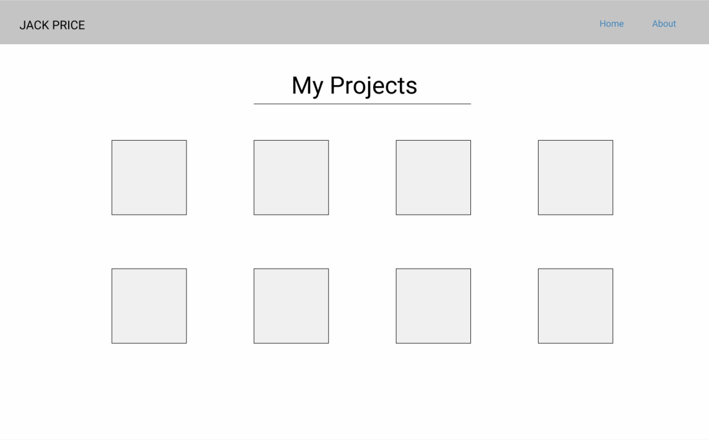
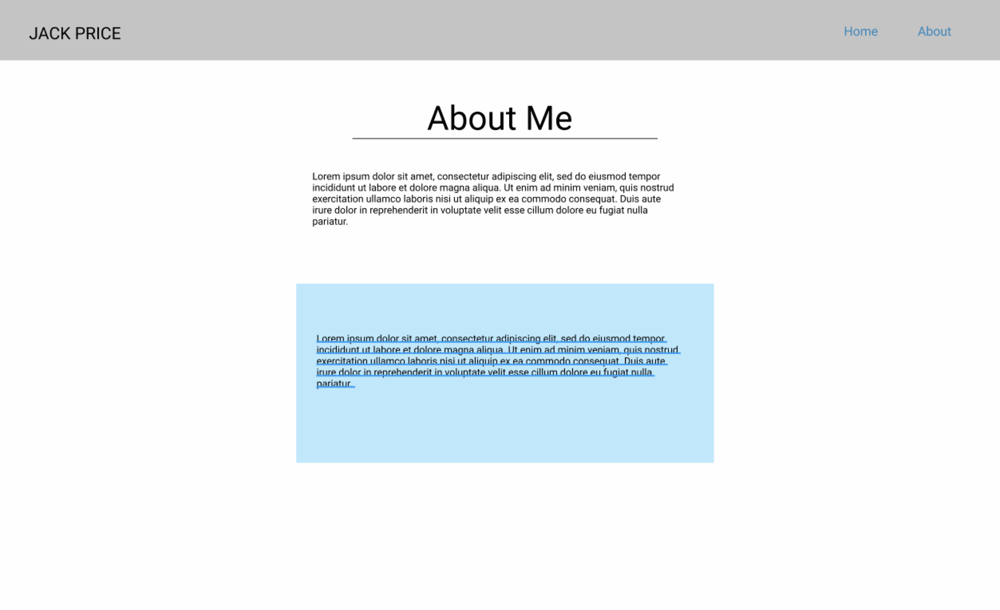

# CSS Challenge

Jack, you're hitting a great stride! Let's not lose the fire.

I want you to build a portfolio page using HTML & CSS. A portfolio is a place you can showcase your work for the world to see. We're gonna make a lot of cool stuff together, so we'd best find a spot to save it.

## Challenge Setup
- Navigate to the `coding_challenges` folder and create a new folder called `02-css`. 

- Open VSCode, and Open the folder `02-html` in the VSCode explorer

- Create three new files in that folder called `index.html`, `about.html`, and `style.css`

- You must use the appropriate `<!DOCTYPE>` and `<html>` formatting tags. [Learn more here](https://www.w3schools.com/tags/tag_doctype.asp). 

- The `<title>` of the Webpage should be `Jack's Portfolio Page`

## Visual Requirements

These are the visual requirements for your portfolio page:

- Your portfolio home page must look identical to the following

- Your portfolio about page must look identical to the following

- `Home` and `About` in the header will be `<a>` tags that link between the home page, and the about page. 

- For the `Home` page, use `` tags with `src`'s from placeholder.com (__HINT__: `src="https://via.placeholder.com/150"`)

- For the `About` page, use Lorem Ipsum text for both of the paragraphs.

## User Acceptance Criteria

User Acceptance Criteria is a technical term for "how does this have to work for the end-user?" As a developer, someone will come to you and say "I want a button that does EVERYTHING." It's your job as a developer to sift through the nonsense, and find out what that person _actually_ wants. 

Your mom could probably give a good explanation too. 

If you can't say "yes" to the following questions after writing your code, you did not pass User Acceptance Criteria, and you need to go back to the drawing board.

As a user, I...

- Can click `Home` in the header, and go to the home page.
- Can click `About` in the header, and go to the about page.
- Can see a paragraph on the `About` page with a no background
- Can see a second paragraph on the `About` page with a light blue background

## Hints & Resources
- https://google.com
- https://freecodecamp.org
- https://w3schools.com
- DIVS, CLASSES, IDS, AND CSS ARE YOUR FRIENDS!!!!!!!!!